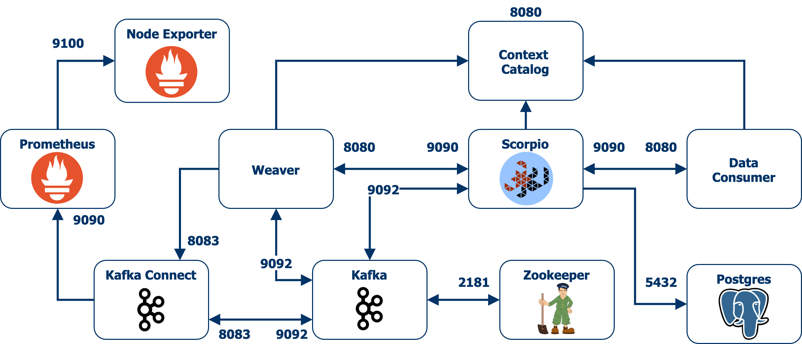

# Semantic Data Aggregator

Docker-based prototype that deploys the semantic data aggregator.

The aggregator is composed of three main elements: the context broker, the context registry, and the data fabric. The first two elements are represented by the Scorpio Broker while the latter is a combination of agents that ingest/deliver data to/from the so-called data substrate represented by Kafka. These agents are dynamically configured by the weaver which subscribes to the context broker for news definitions of data sources and data consumers.

The weaver leverages Apache NiFi to distribute data among data sources and data consumers that are attached to the semantic data aggregator. NiFi enables the definition of graph flows that implement data ingestion mechanisms such as retrieving Prometheus metrics by polling Prometheus REST API, or data delivery mechanisms such as fetching data from Kafka and sending it out to HTTP-based data consumers. 

Kafka plays the role of the data substrate in the semantic data aggregator, hence NiFi relies on Kafka as the distributed reliable storage system to read/write data in the defined graph flows. For the sake of simplicity, the weaver configures NiFi processors to connect to the same Kafka instance that Scorpio runs for its internal communication bus.

Additionally, a dummy context consumer is deployed based on a simple docker image that runs a FastAPI webserver. Basically, the webserver includes an additional REST endpoint that the context consumer can leverage to receive notifications from HTTP subscriptions.



# Requirements

- Docker (_Tested with version 19.03.13_)
- Docker-compose (_Tested with version 1.27.4_)

# Quick Start

Start the prototype by running docker-compose:
```bash
docker-compose up
```

In case you are interested in running the prototype in background (kafka or scorpio logs may be annoying), use the following command:
```bash
docker-compose up -d
```

# Postman Collections

This repository contains Postman collections that you can use to play with the REST APIs of some of the components present in the prototype. We recommend downloading [Postman Desktop](https://www.postman.com/downloads/) for an better user experience.

- [NGSI-LD Prometheus.postman_collection](postman_collections/NGSI-LD%20Prometheus.postman_collection.json) is a set of requests that can be used to interact with the [NGSI-LD Scorpio Broker](https://github.com/ScorpioBroker/ScorpioBroker). This collection includes most of the Entity, Subscription, and Context Source operations that are commonly used in NGSI-LD. The requests contained in this collection can be utilized with other NGSI-LD compliant broker such as [Orion-LD](https://github.com/FIWARE/context.Orion-LD) or [Stellio](https://github.com/stellio-hub/stellio-context-broker).
  
- [API REST Kafka Connect.postman_collection](postman_collections/API%20REST%20Kafka%20Connect.postman_collection.json) provides example requests for all the supported operations in [Kafka Connect REST API](https://docs.confluent.io/current/connect/references/restapi.html).

- [API REST Flink.postman_collection](postman_collections/API%20REST%20Flink.postman_collection.json) provides example requests for the supported operations in [Apache Flink REST API](https://ci.apache.org/projects/flink/flink-docs-release-1.12/ops/rest_api.html).