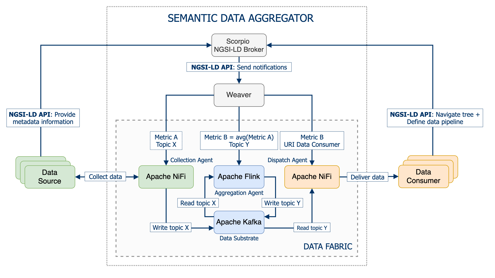

# Semantic Data Aggregator

Docker-based prototype that deploys the `Semantic Data Aggregator` (`SDA`).

The aggregator is composed of three main elements: the context broker, the context registry, and the data fabric. The first two elements are represented by the [`Scorpio Broker`](https://github.com/ScorpioBroker/ScorpioBroker) while the latter is a combination of agents that ingest/deliver data to/from the so-called data substrate represented by [`Kafka`](https://kafka.apache.org/). These agents are dynamically configured by the `Weaver` which subscribes to the context broker for news definitions of data sources and data consumers.

The `Weaver` leverages [`Apache NiFi`](https://nifi.apache.org/) to distribute data among data sources and data consumers that are attached to the `Semantic Data Aggregator`. `NiFi` enables the definition of graph flows that implement data ingestion mechanisms such as retrieving [`Prometheus`](https://Prometheus.io/) metrics by polling `Prometheus` REST API, or data delivery mechanisms such as fetching data from `Kafka` and sending it out to HTTP-based `data consumers`.

`Kafka` plays the role of the data substrate in the `SDA`, hence `NiFi` relies on `Kafka` as the distributed reliable storage system to read/write data in the defined graph flows. For the sake of simplicity, the weaver configures `NiFi` processors to connect to the same Kafka instance that `Scorpio` runs for its internal communication bus.



# Requirements

- Docker (_Tested with version 19.03.13_)
- Docker-compose (_Tested with version 1.27.4_)

# Quick Start

## All-in-one Scenario

To deploy a scenario that comprises the SDA along with all the supported data sources, execute the following command:
```bash
docker-compose up
```

In case you are interested in running the prototype in background (`kafka` or `scorpio` logs may be annoying), use the following command:
```bash
docker-compose up -d
```

Tear the scenario down as follows:
```bash
docker-compose down
```

## Data Source Specific Scenarios

In addition to the all-in-one setup, this repository includes different docker-compose files that deploy scenarios in which the SDA is integrated with a specific data source. These scenarios come handy for debugging purposes and showcasing demos.

### Prometheus-based Data Sources

This scenario deploys a Prometheus instance that is integrated as a data source for the SDA. Additionally, two node-exporter microservices are deployed to emulate two separate machines that send metrics to Prometheus - although both node exporters collect data from the same machine (host machine).

1) Deploy the scenario with the following command:
```bash
docker-compose up  -f docker-compose-prometheus.yml -d
```

2) The [`MetricSource_Demo`](postman_collections/MetricSource_Demo.postman_collection.json) Postman collection provides a demo pipeline that periodically fetches a metric from Prometheus.

3) Lastly, tear the scenario down with:
```bash
docker-compose -f docker-compose-prometheus.yml down
```

### gNMI-based Data Sources (Arista cEOS)

If you are interested in running the gNMI-based data collection prototype, follow the next steps:

The purpose of this prototype is collect data of [`gNMI`](https://github.com/openconfig/reference/blob/master/rpc/gnmi/gnmi-specification.md) telemetry-based sources from the `Semantic Data Aggregator`. For this proof of concept with gNMI data sources, the prototype has two main resources: docker instances of `Arista cEOS` routers as network devices and YANG-based data sources that support the `gNMI` management protocol and a CLI client that provides a full support of `gNMI` RPCs called [`gNMIc`](https://gnmic.kmrd.dev/) to request the configuration and operational status from these telemetry-based network devices.

To get a fine-grained view on how to extract telemetry information of `Arista cEOS` routers using the `gNMIc` client from our semantic data aggregator, follow the [`gNMI Telemetry Proof of Concept Recipe`](docs/gnmi-telemetry-recipe/README.md).

1) Before starting docker-compose it is necessary to import the [`Arista cEOS`](https://www.arista.com/en/products/software-controlled-container-networking) router docker image. Specifically, the scenario uses one of the latest available Arista cEOS versions `cEOS-lab-4.25.4M`. Download it first from the [Arista software section](https://www.arista.com/en/support/software-download) (it is the 64-bit version).

2) The command to import the image is:
```bash
docker import cEOS64-lab-4.25.4M.tar.xz ceos-image:4.25.4M
```

3) Then you can start the docker-compose:
```bash
docker-compose -f docker-compose-arista.yml up
```

4) The [`TelemetrySource_Demo`](postman_collections/TelemetrySource_Demo.postman_collection.json) Postman collection provides a demo pipeline that subscribes to a YANG XPath of a network device through the gNMI protocol.

5) Tear the scenario down with:
```bash
docker-compose -f docker-compose-arista.yml down
```

### Kafka-based Data Sources

Kafka is another type of data source supported by the SDA. More precisely, the ICT-17 5G-EVE project represents a use case that provides monitoring data through Kafka. In this use case, the SDA enables interoperability by integrating a data source from an ICT-17 environment, and then aggregating and delivering the data to other domains such as 5Growth.

1) For the 5G-EVE use case, we simply re-use the same Kafka instance to work as both the data source and the SDA's data substrate. Let's deploy the all-in-one scenario:
```bash
docker-compose up  -d
```

2) The [`EVESource_Demo`](postman_collections/EVESource_Demo.postman_collection.json) Postman collection provides a demo pipeline that subscribes to a Kafka topic.

3) To generate synthetic data compliant with 5G-EVE data model, the [complex-publisher](docker/complex-publishers) microservice offers a utility that generates random data into a Kafka topic. For instance, execute the following command to generate 10 new metrics:
```bash
docker exec -it complex-publisher python3 /5GEVE-publisher/publisher.py kafka:9092 spain-5tonic.topic-1 10
```

4) Once you are done, tear the scenario down with:
```bash
docker-compose down
```


# SDA Orchestration

In order to orchestrate the life cycle management of the `Semantic Data Aggregator` by an external application or system, the prototype uses he `NGSI-LD` API like an interface that allows translating orders from an external orchestrator component to requests to the `SDA` and extending the `NGSI-LD` data model for that. This is an approach to orchestrate the state of those `NGSI-LD` entities that represent the different stages in the data pipelines and model the activity of the Data Aggregator agents.

To get a full view of the `SDA` orchestration process and to be able to build a full data pipeline for data aggregation, see [`Semantic Data Aggregator Orchestration`](docs/sda-orchestration/README.md).

# Stream Processing Aplications Management

The `SDA` makes use of the [`Apache Flink`](https://flink.apache.org/) engine, as part of its aggregation agent, to allow the execution of stream processing applications. The `SDA` allows to dynamically orchestrate the upload and submission of stream processing applications to the `Flink` engine in order to easily manage their execution.

For more information on how `SDA` internally manages the uploading and execution of stream processing applications, see [`Stream Processing Applications Management`](docs/stream-processing/README.md).

# Postman Collections

This repository contains Postman collections that you can use to play with the REST APIs of some of the components present in the prototype. We recommend downloading [Postman Desktop](https://www.postman.com/downloads/) for an better user experience.

- [`NGSI-LD API Orchestrator`](postman_collections/NGSI-LD%20API%20Orchestrator.postman_collection.json) Postman collection has a set of requests that can be used to interact with the [`NGSI-LD Scorpio Broker`](https://github.com/ScorpioBroker/ScorpioBroker) in order to model a full `NGSI-LD` datapipeline for data aggregation and orchestrate the life cycle of the entities involved in it, based on the `NGSI-LD` API. This collection includes most of the Entity, Subscription, and Context Source operations that are commonly used in `NGSI-LD`. The requests contained in this collection can be utilized with other `NGSI-LD` compliant broker such as [Orion-LD](https://github.com/FIWARE/context.Orion-LD) or [Stellio](https://github.com/stellio-hub/stellio-context-broker).

- [`Flink REST API`](postman_collections/API%20REST%20Flink.postman_collection.json) provides example requests for the supported operations in [Apache Flink REST API](https://ci.apache.org/projects/flink/flink-docs-release-1.12/ops/rest_api.html).

- [`YANG Catalog REST API`](postman_collections/yangcatalog.postman_collection.json) provides a collection of sample requests for interacting with the REST API of [YANG Catalog](https://yangcatalog.org). For more details, visit [Contribute to YANG Catalog](https://yangcatalog.org/contribute.html) webpage.
