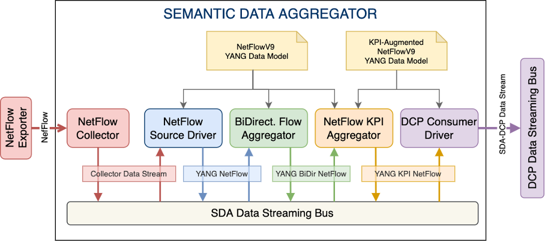

# Semantic Data Aggregator

The `Semantic Data Aggregator` (`SDA`) is a semantic, model-driven monitoring component that enables data collection, data transformation, and data aggregation from different monitoring elements, and coordinates the flow of these data among a set of heterogeneous data sources and data consumers. By using formal data models, defined by means of the YANG modelling language ([RFC7950](https://datatracker.ietf.org/doc/rfc7950/)), the `SDA` allows the programmer to abstract from the encoding and data model differences between monitoring information source and consumer. Such abstraction allows the generalization of the pre-processing stage, which will no longer need to be different for each source-to-consumer combination.

> **IMPORTANT NOTE:**
>
> This is a release of the `SDA` framework for the PALANTIR H2020 European project.

In PALANTIR H2020 European project, the `SDA` is part of the Hybrid Threat Intelligence Framework and has been adapted to the specific case of monitoring network flows to perform data normalization, and enriching the obtained information by means of data aggregation. This aggregation will provide useful data to achieve better results by the subsequent threat classification analysis for cryptomining detection. The resulting `SDA` architectural design for PALANTIR is shown below.

The internal architecture of the `SDA` is based on a chain of five different components communicating via a data streaming bus and two YANG data models that define the schema of the data that is serialized by one application to be sent to the next application. These components and the YANG data models are briefly introduced below.

## NetFlow v9 and KPI-Augmented NetFlow v9 YANG data models

A YANG data model aligned with NetFlow version 9 has been designed to captures the semantic contents from
the NetFlow export packet that are relevant for subscribers to NetFlow monitoring data (i.e., packet header and data flow sets). In addition a KPI-Augmented NetFlow v9 YANG data model is specifically defined to add additional parameters to each network flow that can be computed from the original data flow set and can be useful for AI engines to detect different anomalies in the analysed network flows. The details of both YANG data models can be found [here](yang-models/README.md).

## NetFlow Collector

The NetFlow Collector is the component in charge of receiving NetFlow v9 packets from a NetFlow Exporter and serializing the network flow information into the `SDA` Data Streaming Bus. This component is defined with the idea of reusing existing open-source NetFlow Collectors that will be able to output the received flow to a data streaming bus using a format that will be later adapted to the NetFlow v9 YANG data model schema by the NetFlow Source Driver.
 
## NetFlow Source Driver

The NetFlow Source Driver is responsible for adapting the Collector Data Stream to a YANG NetFlow stream that follows the NetFlow v9 YANG data model schema. This component will take advantage of the software tools that are able to automatically create code from YANG files, in this case from the NetFlow v9 YANG data model. 

## Bidirectional Flow Aggregator

The Bidirectional Flow Aggregator is the component in charge of transforming the unidirectional network flows that are often captured by Flow Exporters into bidirectional flows. It is based on using a window to select the unidirectional flows that need to be combined, based on src-address, dst-address, src-port and dst-port.
 
## NetFlow KPI Aggregator

The NetFlow KPI Aggregator is responsible for calculating the additional KPIs and generating the YANG KPI Netflow data stream following the KPI-Augmented NetFlow v9 YANG data model schema.
 
## DCP Consumer Driver

The `DCP` Consumer Driver is the end of the `SDA` pipeline, in charge of adapting the normalized and aggregated events to the consumer, generating the SDA-DCP Data Stream containing the enriched monitoring data stream in the CSV data schema followed by the `Distributed Collection and Data Preprocessing `(i.e., `DCP`) in the Hybrid Threat Intelligence Framework of the PALANTIR platform.

# Implementation details

All the SDA-related subcomponents are developed to be deployed as services in a Kubernetes environment. A Kubernetes Helm Chart is used to deploy the SDA-related components for the full SDA-related NetFlow data pipeline processing. For the deployment and integration of the `SDA` framework for NetFlow processing within the Threat Intelligence Framework of the PALANTIR infrastructure, follow the details [here](kubernetes/netflow-sda-full-pipeline/README.md). The implementation details of each component is briefly analysed below.

## GoFlow2 NetFlow Collector

Within the `SDA`, the [GoFlow2](https://github.com/netsampler/goflow2) tool allows collecting network flows aligned with NetFlow v9 protocol. GoFlow2 is an open-source collector implementation that gathers network information from different flow protocols (i.e., NetFlow, IPFIX, and sFlow), and serialises into encoding formats such as JSON or Protobuf. GoFlow2 supports NetFlow version 9, and both IPv4 and IPv6. In addition, it can send the collected data to a message queue service such as Apache Kafka. This NetFlow Collector solution was chosen mainly because it is compatible with NetFlow v9, as well as the specification of the fields associated with the NetFlow records it generates is fairly well aligned with the YANG model developed for NetFlow v9. In addition, GoFlow2 allows serialising NetFlow monitoring data in the JSON encoding format, which makes the data processing more efficient, easier, and human-friendly.

## Adaptation and Aggregation Data Engineering Applications for NetFlow

Within the `SDA`, different applications have been develped to process the NetFlow-based monitoring data, normalise/adapt the data according to the predefined YANG data model for NetFlow v9, and to perform aggregation functions for calculating additional features or KPIs. These application implements the logic of the rest of the components. These applications implement the logic of the rest of the `SDA` components mentioned above (i.e., `NetFlow Source Driver`, `Bidirectional Flow Aggregator`, `NetFlow KPI Aggregator`, and `DCP Consumer Driver`). All these applications are programmed as [Apache Flink](https://flink.apache.org/) data engineering applications.

For the implementation of these applications the `SDA` makes use of a Kubernetes operator for Apache Flink. Spotify has developed a Kubernetes operator for Apache Flink called [flink-on-k8s-operator](https://github.com/spotify/flink-on-k8s-operator) that enables managing the lifecycle of Flink applications. In summary, this Kubernetes operator allows us to orchestrate Flink jobs facilitating the deployment and lifecycle management of the different Flink applications of the `SDA` running on Kubernetes. For more details about the Apache Flink K8s operator and how each SDA-related application is implemented and deployed on top of Kubernetes using it, follow the details [here](kubernetes/flink-operator/README.md).

All Flink applications have been developed in Java, which is its native programming language. Moreover, [YANG Tools](https://docs.opendaylight.org/en/latest/developer-guides/yang-tools.html), which is an OpenDayLight compatible project, allows us to use YANG in Java. More specifically, YANG Tools is a set of libraries and tooling that supports the use of YANG in Java and allows normalising data according to a specific YANG data model and serialising that YANG-modelled data into a JSON or XML encoding format ([RFC7951](https://datatracker.ietf.org/doc/rfc7951/)). For the sake of interoperability, we will use the JSON-IETF format, which is a standardised JSON encoding format for representing YANG-modelled data. Using YANG Tools, we can generate Java classes automatically from a YANG model (also known as Java bindings), and instantiate them in the Flink applications to serialise, deserialise and perform the relevant transformations over data normalised according to the YANG model. The source code of each Flink application is available [here](flink-applications/).

## SDA and Cryptomining Detection System

The data aggregated and processed by the `SDA` framework can be consumed by other external systems to continue procesing the data, for anomaly detection, or for threat classification, among others. The `Cryptomining Detection System` (i.e., `CDS`) is a consumer system for the `SDA` with the purpose to detect cryptomining traffic from NetFlow-based monitoring data. For more details about the `CDS`, follow the details [here](kubernetes/crypto-detector/README.md).

In addition, there is available a Kubernetes Helm Chart to deploy the `CDS` along with the SDA-related components for detecting cryptoming traffic from NetFlow-based monitoring data. For the deployment and integration of the `SDA` framework for NetFlow processing and the `CDS` for cryptomining traffic detection within the Threat Intelligence Framework of the PALANTIR infrastructure, follow the details [here](kubernetes/netflow-sda-cds-full-pipeline//README.md).

# Acknowledgements

This work has been partly funded by the European Union’s Research and Innovation Programme Horizon 2020 under the following Grant Agreements:

[5GROWTH](https://5growth.eu) (No. 856709) | [5G-CLARITY](https://www.5gclarity.com) (No. 871428) | [PALANTIR](https://www.palantir-project.eu) (No. 883335)
:-------------------------:|:-------------------------:|:-------------------------:
 |  | 

# License

This project is licensed under [Apache-2.0](https://www.apache.org/licenses/LICENSE-2.0).
