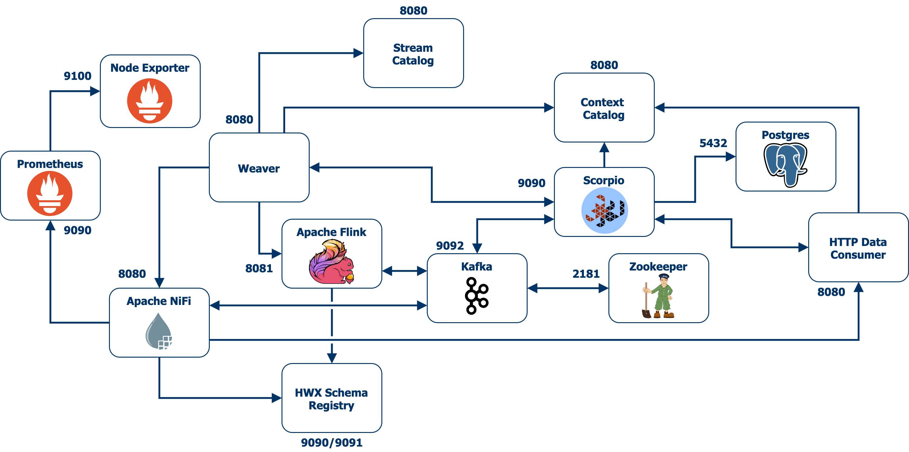

# Semantic Data Aggregator

Docker-based prototype that deploys the `Semantic Data Aggregator` (`SDA`).

The aggregator is composed of three main elements: the context broker, the context registry, and the data fabric. The first two elements are represented by the [`Scorpio Broker`](https://github.com/ScorpioBroker/ScorpioBroker) while the latter is a combination of agents that ingest/deliver data to/from the so-called data substrate represented by `Kafka`. These agents are dynamically configured by the `Weaver` which subscribes to the context broker for news definitions of data sources and data consumers.

The `Weaver` leverages [`Apache NiFi`](https://nifi.apache.org/) to distribute data among data sources and data consumers that are attached to the `Semantic Data Aggregator`. `NiFi` enables the definition of graph flows that implement data ingestion mechanisms such as retrieving `Prometheus` metrics by polling Prometheus REST API, or data delivery mechanisms such as fetching data from [`Kafka`](https://kafka.apache.org/) and sending it out to HTTP-based `data consumers`.

`Kafka` plays the role of the data substrate in the `SDA`, hence `NiFi` relies on `Kafka` as the distributed reliable storage system to read/write data in the defined graph flows. For the sake of simplicity, the weaver configures `NiFi` processors to connect to the same Kafka instance that `Scorpio` runs for its internal communication bus.

Additionally, a dummy context consumer is deployed based on a simple docker image that runs a [FastAPI](https://fastapi.tiangolo.com/) webserver. Basically, the webserver includes an additional REST endpoint that the context consumer can leverage to receive notifications from HTTP subscriptions.



# Requirements

- Docker (_Tested with version 19.03.13_)
- Docker-compose (_Tested with version 1.27.4_)

# Quick Start

## Build Docker images

The prototype is composed by some containers which require building their Docker images. Utility script `build-docker.sh` eases the process of building such images. So far, it only supports building the `schema-registry:0.9.0` image. To do so, run the following command:
```bash
./build-docker.sh build-registry
```
It is expected for future works to support more building procedures for images such as `weaver`.

## Run the prototype

Start the prototype by running docker-compose:
```bash
docker-compose up
```

In case you are interested in running the prototype in background (`kafka` or `scorpio` logs may be annoying), use the following command:
```bash
docker-compose up -d
```

If you are interested to run the gNMI-based data collection prototype, follow the next steps:

1) Before starting docker-compose it is necessary to import the [`Arista cEOS`](https://www.arista.com/en/products/software-controlled-container-networking) router docker image. Specifically, the scenario uses one of the latest available Arista cEOS versions `cEOS-lab-4.24.5M`. Download it first from the [Arista software section](https://www.arista.com/en/support/software-download) (it is the non-64-bit version).

2) The command to import the image is:
```bash
docker import cEOS-lab-4.24.5M.tar ceos-image:4.24.5M
```

3) Then you can start the docker-compose:
```bash
docker-compose -f docker-compose-arista.yml up
```

The purpose of this prototype is collect data of [gNMI](https://github.com/openconfig/reference/blob/master/rpc/gnmi/gnmi-specification.md) telemetry-based sources from the `Semantic Data Aggregator`. For this proof of concept with gNMI data sources, the prototype has two main resources: docker instances of `Arista cEOS` routers as network devices and YANG-based data sources that support the gNMI management protocol and a CLI client that provides a full support of gNMI RPCs called [`gNMIc`](https://gnmic.kmrd.dev/) to request the configuration and operational status from these telemetry-based network devices.

To get a fine-grained view on how to extract telemetry information of Arista cEOS routers using the gNMIc client from our semantic data aggregator, follow the [`gNMI Telemetry Proof of Concept Recipe`](docs/gnmi-PoC-recipe/README.md).

## Upload Avro schemas

Every data source supported by the SDA has one or more Avro schemas associated. The collection agent of the SDA implements drivers responsible for transforming the collected raw data into a pre-defined Avro schema. Before interacting with the SDA, make sure that these Avro schemas are uploaded in the schema registry. The SDA prototype currently leverages HWX Schema Registry to store Avro schemas. More details on how to upload schemas can be found [here](https://github.com/giros-dit/semantic-data-aggregator/blob/develop/docs/nifi-schemas/nifi-schema-registry.md#uploading-schemas-to-the-registry).

For now, the data sources supported by the SDA are Prometheus and gNMI-based devices. The respective Avro schemas can be fetched from the following links:

> __IMPORTANT__: Notice the name specified when uploading the schemas to the registry
>

1. [Prometeus - Openmetrics schema](https://github.com/giros-dit/semantic-metrics-datamodels/blob/main/models/openmetrics/avro/openmetrics.avsc): Store schema with `openmetrics` name
2. [gNMI - Openconfig-interfaces schema](https://github.com/giros-dit/semantic-metrics-datamodels/blob/main/models/openconfig/avro/openconfig-interfaces.avsc): Store schema with `openconfig-interfaces` name

Note that the SDA only supports the `openconfig-interfaces` YANG model for gNMI-based data sources. Once we add support for the rest of YANG models, new Avro schemas will be defined for this data source.

# SDA Orchestration

In order to orchestrate the life cycle management of the `Semantic Data Aggregator` by an external application or system, the prototype uses he `NGSI-LD` API like an interface that allows translating orders from an external orchestrator component to requests to the `SDA` and extending the `NGSI-LD` data model for that. This is an approach to orchestrate the state of those `NGSI-LD` entities that represent the different stages in the data pipelines and model the activity of the Data Aggregator agents.

To get a full view of the `SDA` orchestration process and to be able to build a full data pipeline for data aggregation, see [`Semantic Data Aggregator Orchestration`](docs/sda-orchestration/sda-orchestration.md).

# Stream Processing Aplications Management

The `SDA` makes use of the [`Apache Flink`](https://flink.apache.org/) engine, as part of its aggregation agent, to allow the execution of stream processing applications. The `SDA` allows to dynamically orchestrate the upload and submission of stream processing applications to the `Flink` engine in order to easily manage their execution.

For more information on how `SDA` internally manages the uploading and execution of stream processing applications, see [`Stream Processing Applications Management`](docs/stream-processing/stream-processing-management.md).

# Postman Collections

This repository contains Postman collections that you can use to play with the REST APIs of some of the components present in the prototype. We recommend downloading [Postman Desktop](https://www.postman.com/downloads/) for an better user experience.

- [`NGSI-LD API Orchestrator`](postman_collections/`NGSI-LD`%20API%20Orchestrator.postman_collection.json) Postman collection has a set of requests that can be used to interact with the [`NGSI-LD Scorpio Broker`](https://github.com/ScorpioBroker/ScorpioBroker) in order to model a full `NGSI-LD` datapipeline for data aggregation and orchestrate the life cycle of the entities involved in it, based on the `NGSI-LD` API. This collection includes most of the Entity, Subscription, and Context Source operations that are commonly used in `NGSI-LD`. The requests contained in this collection can be utilized with other `NGSI-LD` compliant broker such as [Orion-LD](https://github.com/FIWARE/context.Orion-LD) or [Stellio](https://github.com/stellio-hub/stellio-context-broker).

- [`Flink REST API`](postman_collections/API%20REST%20Flink.postman_collection.json) provides example requests for the supported operations in [Apache Flink REST API](https://ci.apache.org/projects/flink/flink-docs-release-1.12/ops/rest_api.html).

- [`YANG Catalog REST API`](postman_collections/yangcatalog.postman_collection.json) provides a collection of sample requests for interacting with the REST API of [YANG Catalog](https://yangcatalog.org). For more details, visit [Contribute to YANG Catalog](https://yangcatalog.org/contribute.html) webpage.
