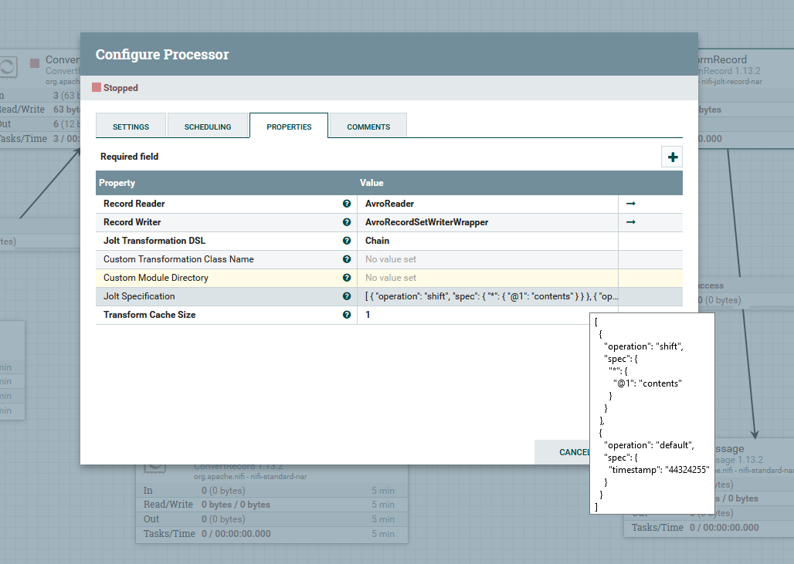
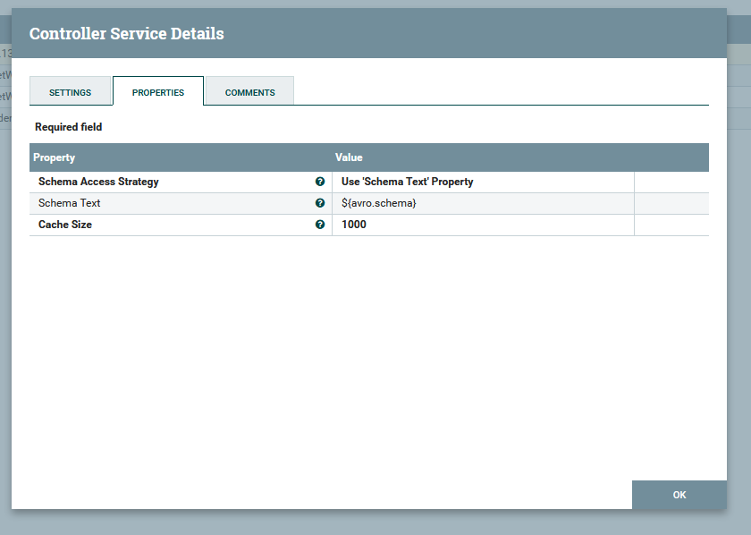
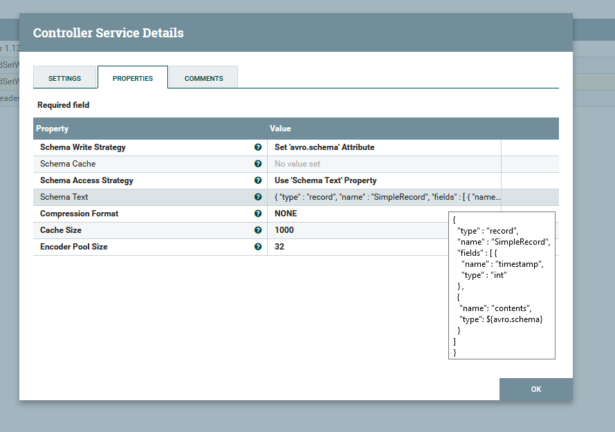

# Building Avro Notification Wrapper

YANG subtree snapshots are first encoded into Avro using pyangbind, and then sent to another NiFi processor that wraps the Avro message with another Avro message named `notification wrapper`. NiFi provides the `JoltTransformRecord` processor that allows for parsing a record-based Flowfile, apply Jolt transformations as if it were a JSON file, and outputs a new Flowfile as per the output Avro schema. This output schema corresponds to the aforementioned `notification wrapper` schema.

The following screenshot depicts the configuration of the `JoltTransformRecord` processor that parses the input Flowfile and places its contents within a new field called `contents`. Additionally, this processor appends a `timestamp` field that represents the time when the YANG subtree snapshot was generated. For the sake of testing this functionality, the value of the `timestamp` field is set to a fixed value.

Regarding the Record Reader, the `AvroReader` service is configured to access the schema by looking up the "Schema Name Property". In turn, the schema text property is filled with the contents of the `${avro.schema}` attribute that was previously attached to the Flowfile of the YANG subtree snapshot. 

On the other hand, the `AvroRecordSetWriter` service is configured as the Record Writer. The schema access strategy is also set to schema text property, but in this case the contents of this property are different. The specified schema is refers to the `notification wrapper` schema that contains two fields: the `timestamp` field, and the `contents` field whose type is a record dynamically generated from the input schema. Hence, the reason to setting the field type to `${avro.schema}`. 

