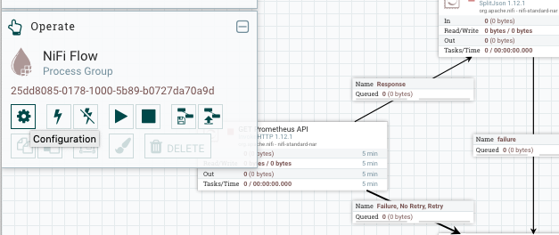
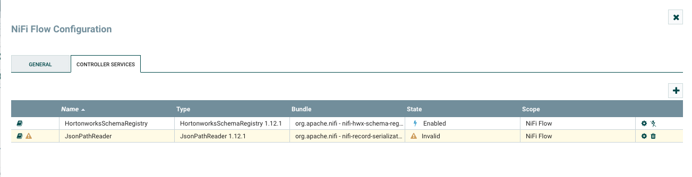
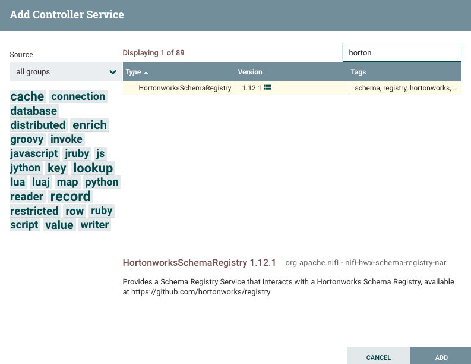
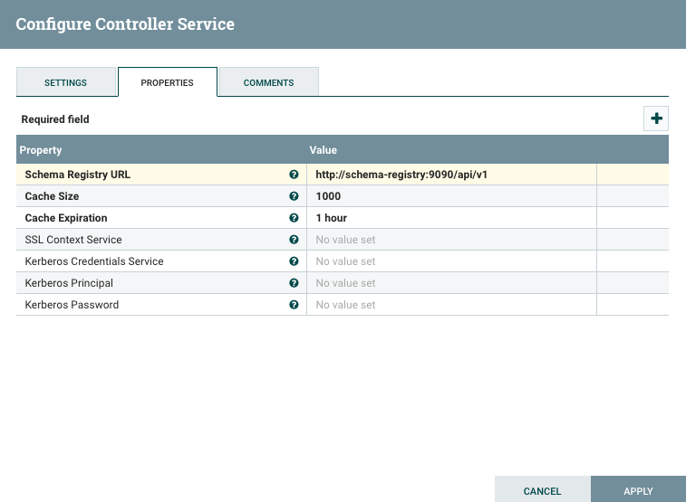
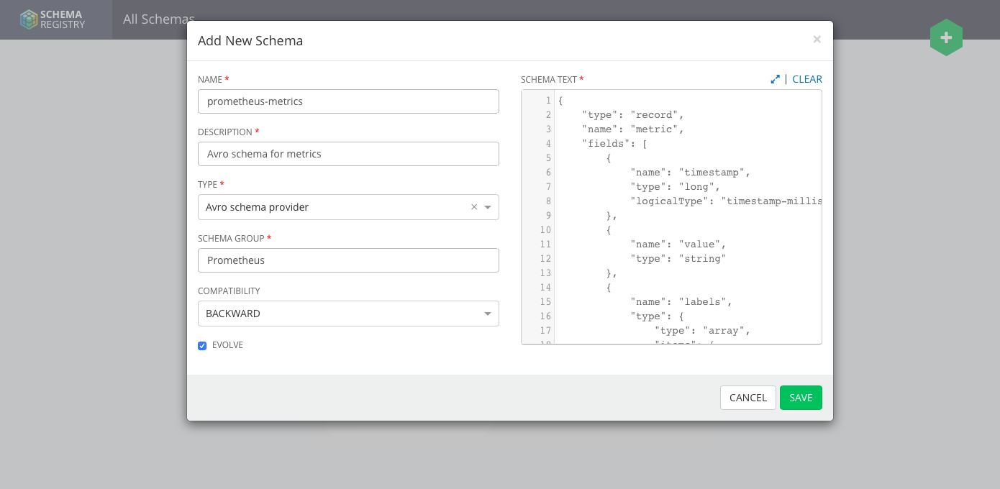
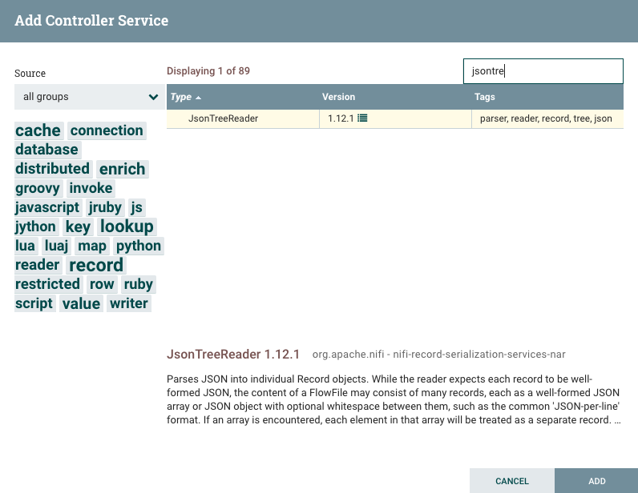
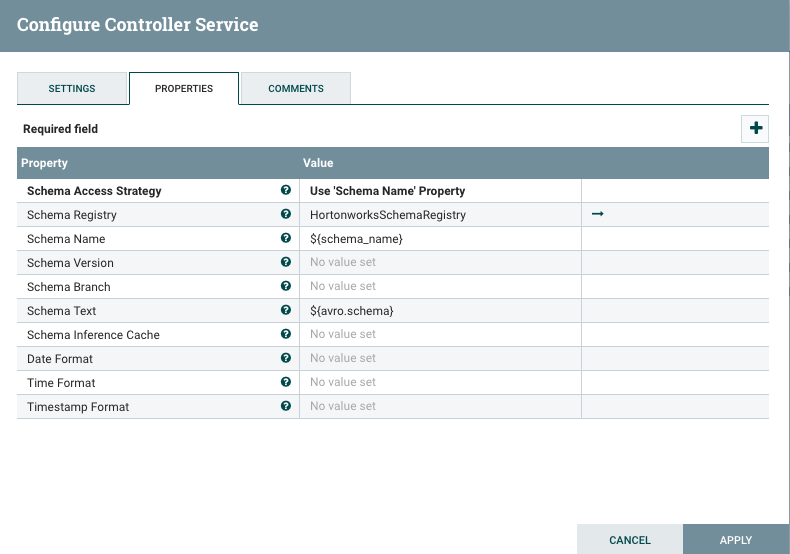
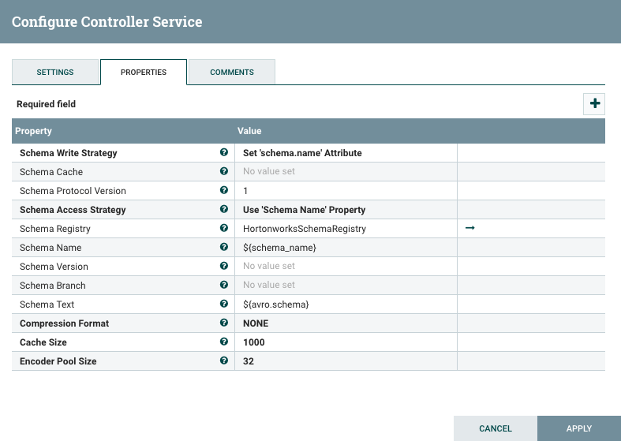
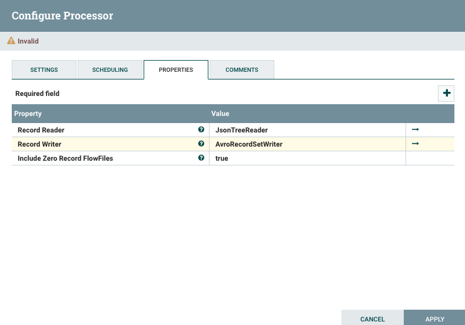

# HWX Schema Registry and Apache NiFi

Hortonworks - now part of Cloudera - provides an open source implementation of a [schema registry](http://registry-project.readthedocs.io/en/latest/). As of this writing, the registry only supports Avro schemas, atlhough there are future plans to add support for other types such as Protobuf or JSON schema.

For our prototype, the registry is deployed as another Docker service. To this end, we build a custom Docker image that containerizes the registry service, and then we deploy it along with a Postgres database as the storage backend. It is worth noting that the registry supports other storage backends such as MySQL or Oracle database, but we chose Postgres as it is already used by the Scorpio Context Broker.

For those impatient, [Bryan Bende](https://bryanbende.com/development/2017/06/20/apache-nifi-records-and-schema-registries), shows a use case of record-oriented processing using HWX Schema Registry that reads a Grok-encoded file, and transforms the parsed data into JSON econding.

## HWX Schema Registry integration

Apache NiFi provides a controller service that enables integrating Hortonworks (HWX) Schema Registry as a repository of Avro schemas. Further details on this controller service can be found at [HortonworksSchemaRegistry](https://nifi.apache.org/docs/nifi-docs/components/org.apache.nifi/nifi-hwx-schema-registry-nar/1.5.0/org.apache.nifi.schemaregistry.hortonworks.HortonworksSchemaRegistry/index.html) in NiFi official docs.

The following steps show how this controller service can be configured manually through NiFi's GUI. Although, this configuration will be automatically done by the weaver by leveraging NiFi's REST API as usual.

1. From NiFi's GUI, on the left hand side there is `Operate` panel for the current flow. Click on the gear button to open the configuration menu.

gear

2. This will open a menu with different tabs at the top. Click on `Controller Services`.

3. Click on the `+` button, search for `HortonworksSchemaRegistry`, and add it.

4. Now that `HortonworksSchemaRegistry` has been added to the list, it's time to configure it. Click on the gear icon, which will display a menu with all the configuration parameters supported by the controller service. For developing purposes, just specify the URL of HWX Schema Registry and leave the remaining parameters with their default values. In our prototype the registry is deployed as another Docker service, thus we leverage docker-compose's DNS to access the registry by its service name.

5. Finally, click on the thunder icon and enable the service.

## Uploading schemas to the registry

HWX Schema Registry provides a friendly GUI that facilitates the management of schemas within the registry. In our dockerized prototype, this GUI is accessible at `http://localhost:9010/ui` (Docker port mapping to the host).

In order to upload a new schema, click on the `+` icon on the upper right corner, and introduce the schema along with all required metadata. In this guide, we won't go into the details of the schema, but we would like to remind the reader that HWX Schema Registry supports forward and backward schema evolution policies.

## Configuring record-oriented processors in NiFi

To demonstrate how we can perform record-oriented processing in NiFi, we take as a example our Prometheus data source use case. In this use case we fetch data from Prometheus by polling its REST API. The data sent by Prometheus are encoded as raw JSON. Our goal is to parse these data, map it to the Avro schema that was previously uploaded to the registry, and encode the structured data into the Avro format.

1. We will start first creating a controller service that allows reading JSON data and parsing them into the Avro schema. To do so, go to `Configuration` of the NiFi flow in the NiFi's GUI - gear icon in the operate panel - and add a new controller service. Search for [JsonTreeReader](https://nifi.apache.org/docs/nifi-docs/components/org.apache.nifi/nifi-record-serialization-services-nar/1.5.0/org.apache.nifi.json.JsonTreeReader/index.html) - there is also the [JsonPathReader](https://nifi.apache.org/docs/nifi-docs/components/org.apache.nifi/nifi-record-serialization-services-nar/1.5.0/org.apache.nifi.json.JsonPathReader/index.html) service available, but the former comes handy in this example - and then add the controller service to the list.

2. Click on the gear button of the controller service to open the configuration menu. The most important configuration property is the `Schema Access Strategy`. This property defines how the Avro schema should be fetched by NiFi. For the sake of simplicity, we will just lookup the schema in the registry by its name, although NiFi supports fetching schemas by version and identifier, or by a content-encoded reference to the schema when the HWX Schema Registry is used.

3. The JSON record reader has been properly configured. Enable it by clicking on the thunder button.

4. Now let's move on to the service that writes the parsed record into Avro format. We will follow the some procedure as before, but this time we will select the `AvroRecordSetWriter` controller service. Similar to the previous step, `Schema Access Strategy` will be configured to fetch the Avro by its name. Notice that in this example we are using the same schema to parse the input record and to encode the output record. This will not always the case as NiFi supports schema evolution within these conversions. Hence, the input and output schemas can be different as long as they are compatible (i.e., they have matching fields as per the Avro specification).

5. Same as before, enable the controller service by clicking on the thunder button.

6. Once the record reader and writer have been configured and enabled, it's time to use them in a NiFi processor. More specifically, we use the `ConvertRecord` processor. This a powerful processor that allows for transforming between different formats based on the specified input and output schemas.

7. At last, we can connect other processors to the instatiated `ConvertRecord` processor in order to feed it with JSON-encoded data. As a result, the parsed data will be transformed into Avro messages according to the schemas that we previously stored in the registry.
