# Semantic Data Aggregator Orchestration

A mechanism to orchestrate the `Semantic Data Aggregator` (SDA) life cycle management by an external application or system using the NGSI-LD API like an interface that allows translating orders from an external orchestrator component to requests to the `SDA` and extending the NGSI-LD data model for that.

This is an approach to orchestrate the state transitions of those NGSI-LD entities that represent the different stages in the data pipelines and model the actions of the Data Aggregator agents.

To deal with the life cycle management of the data aggregator we define the Agent NGSI-LD Entity. This is a parent entity for every life cycle stage of the agent entities in the data pipeline: `MetricSource`, `TelemetrySource`, `MetricTarget`, `MetricProcessor` and `StreamApplication`.

Users or applications can declaratively express the desired state for each agent of the Data Aggregator (`collector`, `aggregator` and `dispatcher`).

The Agent parent entity has the following properties:
-	`action`: property value set by users to change the agent state.
-	`state`: property value updated by the `Weaver` during the action triggered by users to indicate the agent state.
- `stateInfo`: optional cross-domain property to describe errors when the processed action fails or feedback information about the agent state.

The information model for the Agent parent entity is represented below.

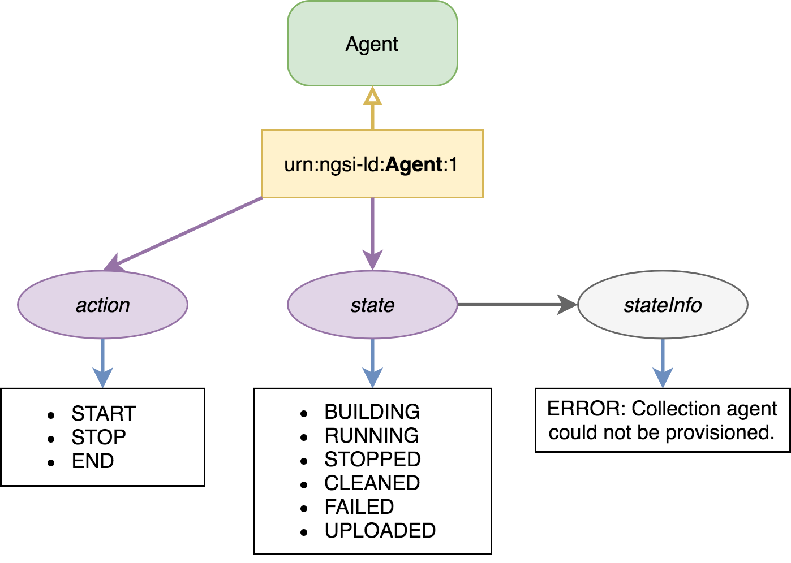

Next, the transition diagram between states is represented (different possible values that the `state` property of agent entities can take). The state transition is triggered through the operation determined by the value of the `action` property (transition actions).

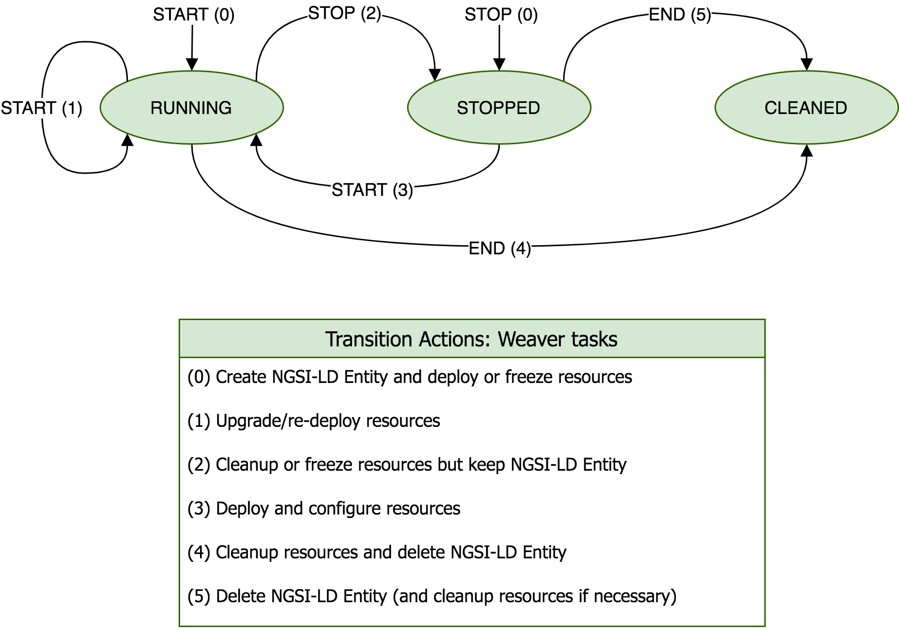

## Collector and Dispatcher Agents Orchestration

`Collector` and `Dispatcher` are two of the types of agents that `SDA` orchestrates, managing the life cycle of these agents that works as a NiFi processors using metadata from the information models.

In the following subsections, different sequence diagrams are detailed to show the state transition management of those NGSI-LD entities that represent the metadata for the collection agents.

### I - Instantiate and upgrade collection agents

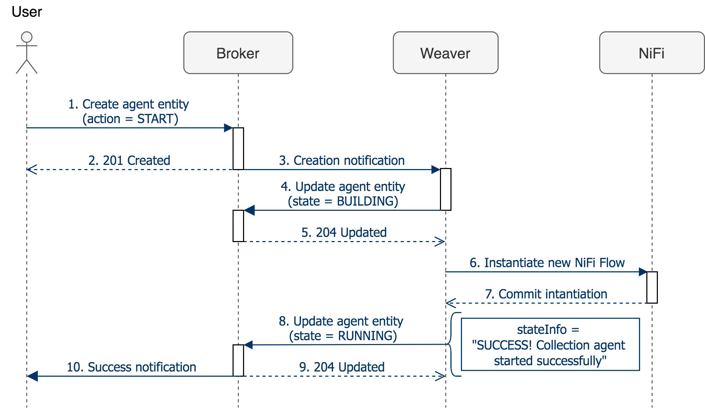

The previous sequence diagram shows the steps that the `SDA` framework follows to allow the collection agent instantiation. This diagram corresponds to the `START(0)` transition action of the state transition diagram. The steps are the following:

1.	First of all, the user has to model and create a new NGSI-LD collection agent entity (e.g., `MetriSource` or `TelemetrySource` entity) in `Scorpio Broker` to describe collection agent metadata. In the entity the user have to define the `action` property (inherited from the `Agent` parent entity) initialized to the `START` value.

2.	The entity creation triggers a notification to the `Weaver` component. The `Weaver` then update the entity with the `state` property initialized to the `BUILDING` value while the collection agent initialization is being processed. 

3.	Then, the `Weaver` manages the configuration and instantiation of the collection agent with a `NiFi` processor.

4.	When `NiFi` successfully instantiates the processor, the `Weaver` update the `state` property of the collection agent entity to the `RUNNING` value and the `stateInfo` cross-domain property with feedback information about the successfully operation.

5.	Finally, the user is notified that the collection agent has been successfully instantiated.

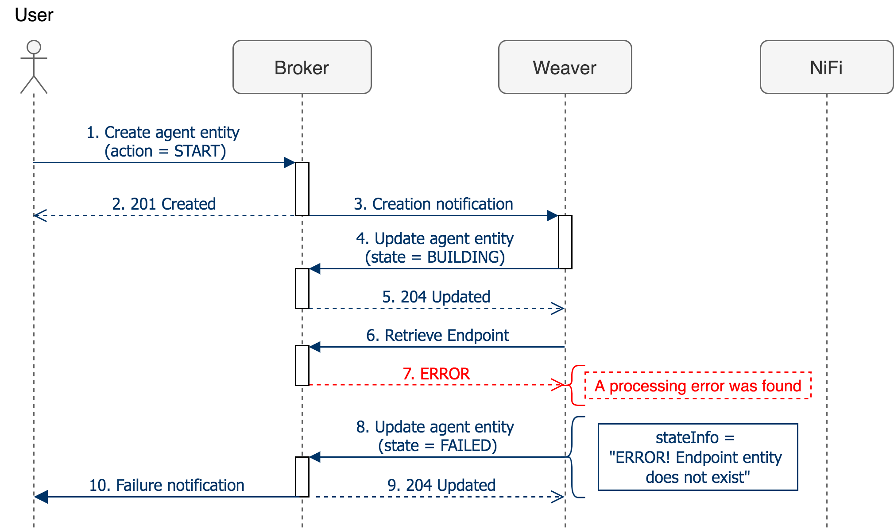

The previous sequence diagram shows an example of `Endpoint` error detection. After creating the collection agent entity and before configuring and instantiating the `NiFI` processor for the collection agent, `Weaver` must check whether or not there is an `Endpoint` entity that defines the data source endpoint from which the information is extracted. If this `Endpoint` entity does not exist, the collection agent configuration and the processor execution will fail. In that case, the `Weaver` will update the `state` property of the collection agent entity to the `FAILED` value and the `stateInfo` cross-domain property with feedback information about the failed operation. Finally, the user is notified that the collection agent could not be instantiated.

The previous sequence diagram shows the steps that the framework follows to allow the collection agent upgrade. This diagram corresponds to the `START(1)` or the `START(3)` transition action of the state transition diagram. The steps are the following:

1.	First of all, user has to update the previously created NGSI-LD collection agent entity (e.g., `MetriSource` or `TelemetrySource` entity) in `Scorpio Broker`. To do this, the `action` property must be updated to the `START` value.

2.	The entity upgrade triggers a notification to the `Weaver` component. The `Weaver` then update the entity with the `state` property initialized to the `BUILDING` value while the collection agent upgrade is being processed. 

3.	Then, the `Weaver` manages the configuration and upgrade of the collection agent with a `NiFi` processor.

4.	When `NiFi` successfully upgrades the processor, the `Weaver` update the `state` property of the collection agent entity to the `RUNNING` value and the `stateInfo` cross-domain property with feedback information about the successfully operation.

5.	Finally, the user is notified that the collection agent has been successfully updated.

### II - Deploy and stop collection agent

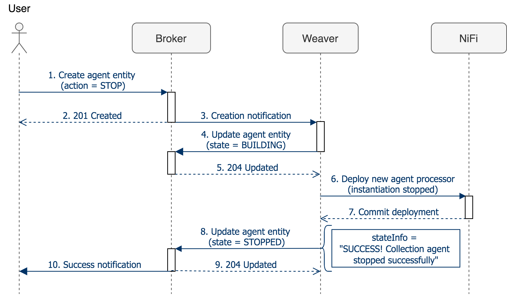

The previous sequence diagram shows the steps that the `SDA` framework follows to allow the collection agent deployment (deploy stopped agent). This diagram corresponds to the `STOP(0)` transition action of the state transition diagram. The steps are the following:

1.	First of all, the user has to model and create a new NGSI-LD collection agent entity (e.g., `MetriSource` or `TelemetrySource` entity) in `Scorpio Broker` to describe collection agent metadata. In the entity the user has to define the `action` property (inherited from the `Agent` parent entity) initialized to the `STOP` value.

2.	The entity creation triggers a notification to the `Weaver` component. The `Weaver` then update the entity with the `state` property initialized to the `BUILDING` value while the collection agent deployment is being processed. 

3.	Then, the `Weaver` manages the configuration and creation of the collection agent with a `NiFi` processor. The `NiFi` processor will be deployed but will not be started.

4.	When `NiFi` successfully deploys the processor, the `Weaver` update the `state` property of the agent entity to the `RUNNING` value and the `stateInfo` cross-domain property with feedback information about the successfully operation.

5.	Finally, the user is notified that the collection agent has been successfully deployed and stopped.

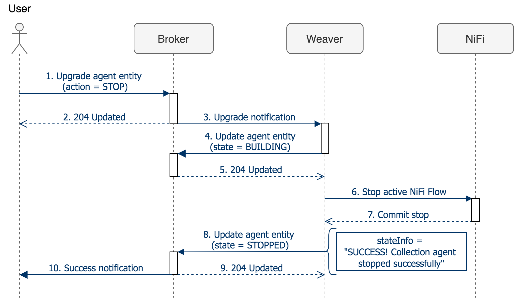

The previous sequence diagram shows the steps that the framework follows to allow the collection agent to stop. This diagram corresponds to the `STOP(2)` transition action of the state transition diagram. The steps are the following:

1.	First of all, user has to update the previously created NGSI-LD collection agent entity (e.g., `MetriSource` or `TelemetrySource` entity) in `Scorpio Broker`. To do this, the `action` property must be updated to the `STOP` value.

2.	The entity upgrade triggers a notification to the `Weaver` component. The Weaver then update the entity with the `state` property initialized to the `BUILDING` value while the collection agent stop is being processed. 

3.	Then, the `Weaver` manages the stop of the collection agent with a `NiFi` processor.

4.	When `NiFi` successfully stops the processor, the `Weaver` update the `state` property of the agent entity to the `STOPPED` value and the `stateInfo` cross-domain property with feedback information about the successfully operation.

5.	Finally, the user is notified that the collection agent has been successfully stopped.

### III - Delete collection agent

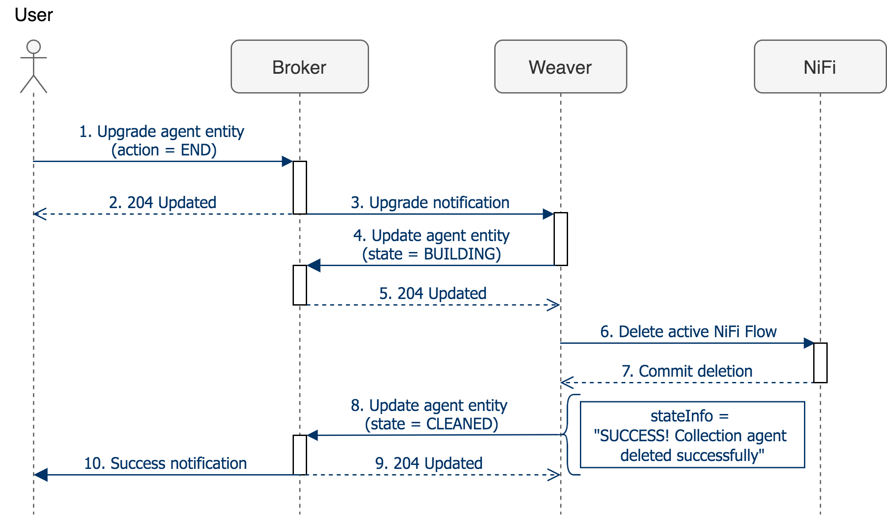

The previous sequence diagram shows the steps that the `SDA` framework follows to allow the collection agent deletion. This diagram corresponds to the `END(4)` or `END(5)` transition action of the state transition diagram. The steps are the following:

1.	First of all, user has to update the previously created NGSI-LD collection agent entity (e.g., `MetriSource` or `TelemetrySource` entity) in `Scorpio Broker`. To do this, the `action` property must be updated to the `END` value.

2.	The entity upgrade triggers a notification to the `Weaver` component. The `Weaver` then update the entity with the `state` property initialized to the `BUILDING` value while the collection agent deletion is being processed. 

3.	Then, the `Weaver` manages the deletion of the collection agent with a `NiFi` processor.

4.	When `NiFi` successfully deletes the processor, the `Weaver` update the `state` property of the agent entity to the `CLEANED` value and the `stateInfo` cross-domain property with feedback information about the successfully operation.

5.	Finally, the user is notified that the collection agent has been successfully deleted.

## Aggregator Agents Orchestration

`Aggregator` is the other type of agent that `SDA` orchestrates, managing the life cycle of this agents that works as a stream processing engine (`Flink`) using metadata from the information models.

In the following subsections, different sequence diagrams are detailed to show the state transition management of those NGSI-LD entities (i.e., `StreamApplication` and `MetricProcessor` entities) that represent the metadata for the aggregation agents.

### I - Upload and delete JAR stream applications

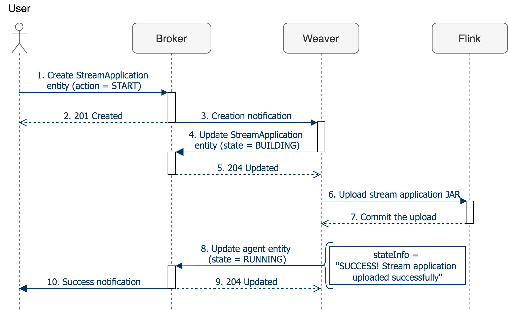

The previous sequence diagram shows the steps that the `SDA` framework follows to allow uploading a JAR stream processing application to the aggregation agent (`Flink` engine). The steps are the following:

1.	First of all, the user has to model and create a new NGSI-LD `StreamApplication` entity in `Scorpio Broker` to describe stream processing application metadata. In the entity the user has to define the `action` property (inherited from the `Agent` parent entity) initialized to the `START` value.

2.	The entity creation triggers a notification to the `Weaver` component. The `Weaver` then update the entity with the `state` property initialized to the `BUILDING` value while the upload of the streaming application is being processed.

3.	Then, the `Weaver` manages the upload of the application JAR to the `Flink` engine.

4.	When the application has been successfully uploaded to the `Flink` engine, the `Weaver` update the `state` property of the `StreamApplication` entity to the `UPLOADED` value and the `stateInfo` cross-domain property with feedback information about the successfully operation.

5.	Finally, the user is notified that the stream processing application has been successfully uploaded.

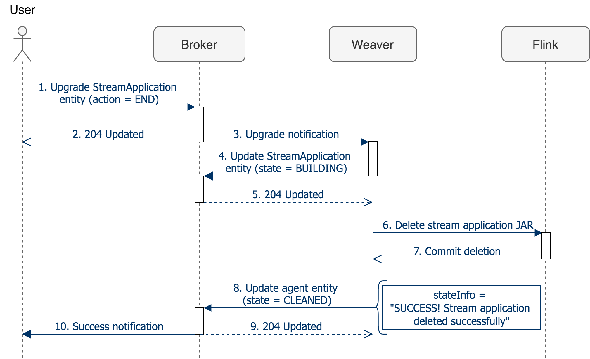

The previous sequence diagram shows the steps that the framework follows to allow deleting a JAR stream processing application from the aggregation agent. The steps are the following:

1.	First of all, the user has to update the previously created NGSI-LD `StreamApplication` entity in `Scorpio Broker`. To do this, the `action` property must be updated to the `END` value.

2.	The entity upgrade triggers a notification to the `Weaver` component. The `Weaver` then update the entity with the `state` property initialized to the `BUILDING` value while the stream application deletion is being processed. 

3.	Then, the `Weaver` manages the deletion of the stream application JAR from the `Flink` engine.

4.	When the application has been successfully deleted from the `Flink` engine, the `Weaver` update the `state` property of the agent entity to the `CLEANED` value and the `stateInfo` cross-domain property with feedback information about the successfully operation.

5.	Finally, the user is notified that the stream processing application has been successfully deleted.

### II - Submit and upgrade Job instances

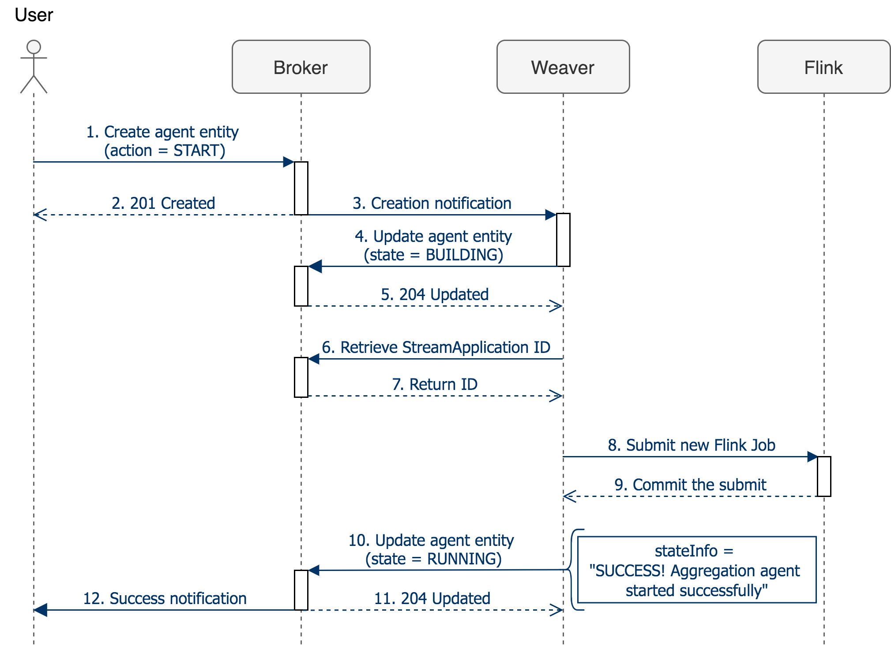

The previous sequence diagram shows the steps that the `SDA`framework follows to allow the Job instance submission to the aggregation agent. This diagram corresponds to the `START(0)` transition action of the state transition diagram. The steps are the following:

1.	First of all, the user has to model and create a new NGSI-LD `MetricProcessor` entity in `Scorpio Broker` to describe stream processing Job metadata. In the entity we have to define the `action` property (inherited from the `Agent` parent entity) initialized to the `START` value.

2.	The entity creation triggers a notification to the `Weaver` component. The `Weaver` then update the entity with the `state` property initialized to the `BUILDING` value while the submit of the Job instance is being processed. 

3.	Then, the `Weaver` manages the submit of the Job instance to the `Flink` engine.

4.	When the Job has been successfully submitted to the `Flink` engine, the `Weaver` update the `state` property of the agent entity to the `RUNNING` value and the `stateInfo` cross-domain property with feedback information about the successfully operation.

5.	Finally, the user is notified that the Job instance has been successfully submitted and is running.

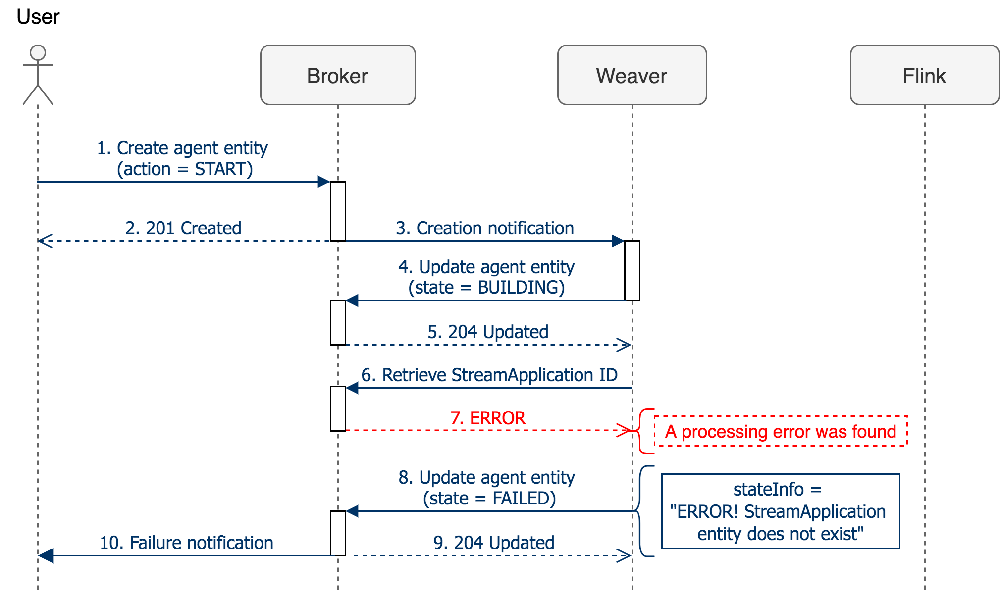

The previous sequence diagram shows and example of `StreamApplication` error detection. After creating the `MetricProcessor` entity and before configuring and submitting the Job instance to the aggregation agent (`Flink` engine), `Weaver` must check whether or not there is a `StreamApplication` entity that identifies the JAR of the stream application to run on the `Flink` engine. If this `StreamApplication` entity does not exist, the aggregation agent configuration and the Job execution will fail. In that case, the `Weaver` will update the `state` property of the agent entity to the `FAILED` value and the `stateInfo` cross-domain property with feedback information about the failed operation. Finally, the user is notified that the Job instance could not be submitted and executed in the `Flink` engine.

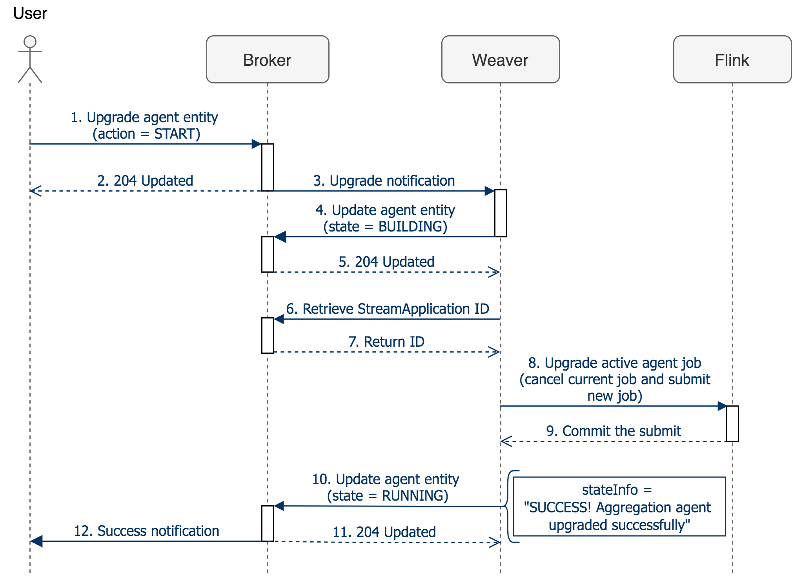

The previous sequence diagram shows the steps that the framework follows to allow the Job instance upgrade to the aggregation agent. This diagram corresponds to the `START(1)` or `START(3)` transition action of the state transition diagram. The steps are the following:

1.	First of all, the user has to update the previously created NGSI-LD `MetricProcessor` entity in `Scorpio Broker`. To do this, the `action` property must be updated to the `START` value.

2.	The entity upgrade triggers a notification to the `Weaver` component. The `Weaver` then update the entity with the `state` property initialized to the `BUILDING` value while the Job instance upgrade is being processed.

3.	Then, the `Weaver` manages the upgrade of the Job instance to the `Flink` engine.

4.	When the Job has successfully updated from the `Flink` engine, the `Weaver` update the `state` property of the agent entity to the `RUNNING` value and the `stateInfo` cross-domain property with feedback information about the successfully operation.

5.	Finally, the user is notified that the Job instance has been successfully updated and is running.

### III - Define and stop Job

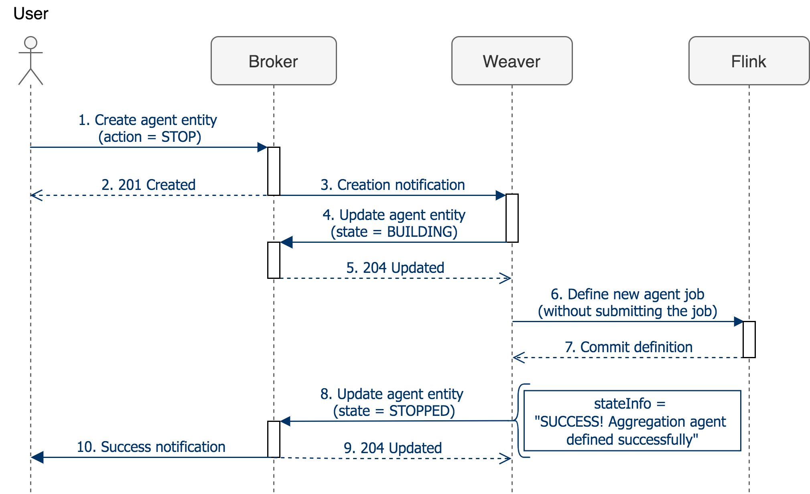

The previous sequence diagram shows the steps that the `SDA` framework follows to allow the Job definition for the aggregation agent. This diagram corresponds to the `STOP(0)` transition action of the state transition diagram. The steps are the following:

1.	First of all, the user has to model and create a new NGSI-LD `MetricProcessor` entity in `Scorpio Broker` to describe stream processing Job metadata. In the entity we have to define the `action` property (inherited from the `Agent` parent entity) initialized to the `STOP` value.

2.	The entity creation triggers a notification to the `Weaver` component. The `Weaver` then update the entity with the `state` property initialized to the `BUILDING` value while the definition of the Job instance is being processed. 

3.	Then, the `Weaver` manages the Job instance definition. That is, th Job instance will be defined but will not be submitted to the `Flink`engine.

4.	When the Job has successfully defined, the `Weaver` update the `state` property of the agent entity to the `STOPPED` value and the `stateInfo` cross-domain property with feedback information about the successfully operation.

5.	Finally, the user is notified that the Job instance has been successfully defined and is stopped.

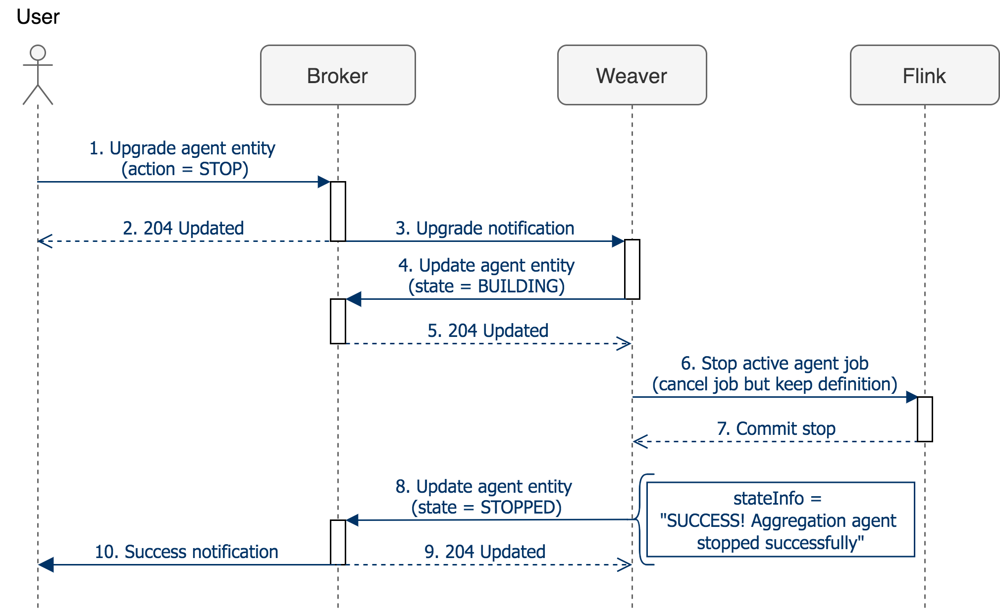

The previous sequence diagram shows the steps that the framework follows to allow stopping the Job instance from the aggregation agent. This diagram corresponds to the `STOP(2)` transition action of the state transition diagram. The steps are the following:

1.	First of all, the user has to update the previously created NGSI-LD `MetricProcessor` entity in `Scorpio Broker`. To do this, the `action` property must be updated to the `STOP` value.

2.	The entity upgrade triggers a notification to the `Weaver` component. The `Weaver` then update the entity with the `state` property initialized to the `BUILDING` value while the Job instance stop is being processed.

3.	Then, the `Weaver` manages the stop of the Job instance from the `Flink` engine.

4.	When the Job has successfully stopped from the `Flink` engine, the `Weaver` update the `state` property of the agent entity to the `STOPPED` value and the `stateInfo` cross-domain property with feedback information about the successfully operation.

5.	Finally, the user is notified that the Job instance has been successfully cancelled and stopped.

### IV - Delete Job

The previous sequence diagram shows the steps that the `SDA` framework follows to allow deleting the Job instance from the aggregation agent. This diagram corresponds to the `END(4)` or `END(5)` transition action of the state transition diagram. The steps are the following:

1.	First of all, user has to update the previously created NGSI-LD `MetricProcessor` entity in `Scorpio Broker`. To do this, the `action` property must be updated to the `END` value.

2.	The entity upgrade triggers a notification to the `Weaver` component. The `Weaver` then update the entity with the `state` property initialized to the `BUILDING` value while the Job instance deletion is being processed.

3.	Then, the `Weaver` manages the deletion of the Job instance from the `Flink` engine.

4.	When the Job has successfully deleted from the `Flink` engine, the `Weaver` update the `state` property of the agent entity to the `CLEANED` value and the `stateInfo` cross-domain property with feedback information about the successfully operation.

5.	Finally, the user is notified that the Job instance has been successfully cancelled and deleted.
