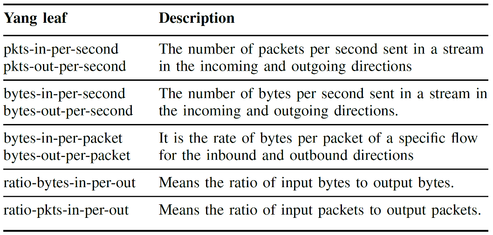
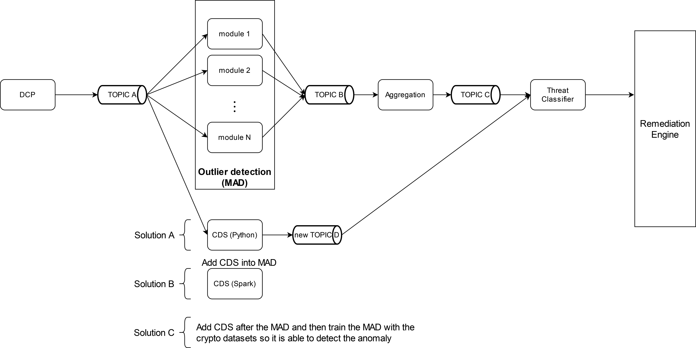

# Cryptomining Detection System (CDS)

## Introduction

The data aggregated and processed by the `SDA` framework can be consumed by other external systems to continue procesing the data, for anomaly detection, or for threat classification, among others. The `Cryptomining Detection System` (i.e., `CDS`) is a consumer system for the `SDA` with the purpose to detect cryptomining traffic from NetFlow-based monitoring data. 

The `CDS` is a Python microservice with a Machine Learning module that makes use of the Scikit-Learn library for training a classification model based on a *Random Forest* classifier in order to get predictions about cryptoming traffic. The dataset used for training the ML model was devided in 16 million of samples for the training subset and 16 million of samples for the testing subset, being samples with cryptomining traffic and non-cryptomining traffic. Both cryptomining and benign traffic are formed by encrypted and non-encrypted connections, in order to accurately simulate all possible kinds of traffic in any machine connected to a server on Internet or on a dedicated network (e.g., web surfing, video and audio streaming, file systems, cloud storage, etc.). The `CDS` uses the features listed in the following table, which are aggregate features calculated by the SDA, in order to provide better prediction results.



The application reads events from a Kafka topic following a specific CSV schema and writes the results in another topic whether or not the resulting traffic belongs to cryptomining traffic. 

The `CDS` application can be deployed as a service in Kubernetes and this folder provides the YAML templates to install the K8s-related resources. To install the `CDS` within the regarding K8s cluster, run the following command inside the current folder with the `kubectl` client:
```bash
kubectl [--kubeconfig <kubeconfig-file>] [-n <namespace>] apply -f crypto_detection-singletenant.yaml
```

In the [crypto-detection-singletenant.yaml](crypto-detection-singletenant.yaml) template file allows parameterizing differents arguments within the `args` statement needed to deploy the CDS. The main arguments are the following:
- `-b <kafka_broker>`, where `<kafka_broker>` is the Kafka broker service endpoint.
- `-c <input_topic>`, where `<input_topic>`is the Kafka input topic for the CDS.
- `-p <output_topic>`, where `<output_topic>`is the Kafka output topic for the CDS.

In addition, there is a variant template file [crypto-detection-multitenants.yaml](crypto-detection-multitenants.yaml) for deploying the CDS to support the PALANTIR multi-tenancy service. This template includes the following additional parameters:
- `-ts <tenant_service>`, where `<tenant_service>` is the endpoint of the multi-tenancy service available within the PALANTIR platform that allows to get the Kafka topic partition associated with a specific tenant ID.
- `-tid <tenant_id>`, where `<tenant_id>`is the tenant ID needed to get the particular Kafka topic partition associated with it. 

Also, the `image` statement of the template files specifies the container image needed to build and deploy the application in Kubernetes. The CDS application has a custom Docker image that must be uploaded/downloaded to/from an available Docker image registry available at a particular endpoint (i.e., `<k8s-registry-ip>:<k8s-registry-port>`) in the Kubernetes cluster. The Dockerfile and requirements to build the Docker image of the CDS application can be found [here](../../docker/crypto-detector/).

## CDS integration with the Threat Intelligence components in PALANTIR platform

Once the NetFlow-related monitoring data has been properly processed by the `SDA` and `DCP` (i.e., the `Data Collection and Data Preprocessing` component), the resulting data will be produced in a Kafka topic following the following data schema called `Anonymized & Preprocessed NetFlow Data + Aggregated features`.

```bash
ts,te,td,sa,da,sp,dp,pr,flg,fwd,stos,ipkt,ibyt,opkt,obyt,in,out,sas,das,smk,dmk,dtos,dir,nh,nhb,svln,dvln,ismc,odmc,idmc,osmc,mpls1,mpls2,mpls3,mpls4,mpls5,mpls6,mpls7,mpls8,mpls9,mpls10,cl,sl,al,ra,eng,exid,tr,zeek_extra_field,pktips,pktops,bytips,bytops,bytippkt,bytoppkt,bytipo,pktipo,tpkt,tbyt,cp,prtcp,prudp,pricmp,prigmp,prother,flga,flgs,flgf,flgr,flgp,flgu
```

>The `zeek_extra_field` is an extra field to be added because is needed to be consider and filled by the `Zeek` monitoring component in PALANTIR.

For the integration of the Cryptomining Detection System in the Threat Intelligence ecosystem of the PALANTIR project, three solutions were proposed:

- A) In this solution the `CDS` component is running in parallel with the `Multimodal Anomaly Detection` (i.e., `MAD`) component, so all the traffic from topic A will be read from the CDS. This may cause problems if the CDS is not powerfull enough to handle the rate needed.

- B) Due to the potencial rate problem mentioned before, a solution will be to move the implementation of the `CDS` from a Python application to a Spark streaming application, so that the resulting implementation allows for a higher message rate and performance.

- C) Other solution to solve the high rate will be to add the `CDS` after the `MAD` component, so the traffic is filtered and the CDS only receives potential anomalies detected. In this solution, it will be needed to use the samples available in the crypto-related datasets to train another MAD module able to detect cryptomining attacks as an anomaly.



According to the final decision, the proposal was the `A` solution. In such solution, the `CDS` consumes directly the input information following the schema of the data provided by the `DCP` component. The `CDS` has been tested to measure its latency performance, and it has been validated that it behaves properly. In the [`stats/`](stats/) folder there is a test environment used to validated the `CDS` performance.

The output data schema of the `CDS` adds the following features to the `Anonymized & Preprocessed NetFlow Data + Aggregated features` input data schema: 
   ```
   Threat_Label="Crypto"
   Threat_Category="Malware"
   Classification_Confidence = ...
   ```
, where the `Classification_Confidence` includes the prediction result about cryptomining traffic. The resulting information is written in another Kafka topic where the `Threat Classification and Alarm Management` (i.e., `TCAM`) component can consume it in order to classify the corresponding threat.