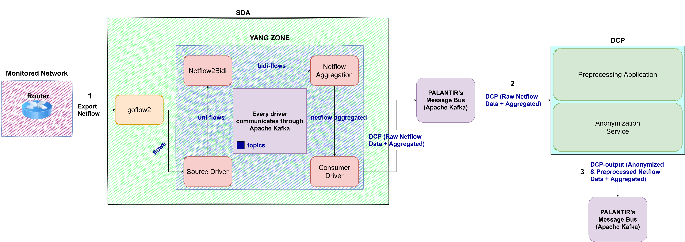

# SDA NetFlow full data pipeline (including CDS) within PALANTIR
This folder provides a Kubernetes Helm Chart used to deploy the SDA-related components (i.e., GoFlow2 collector and Flink applications) for the NetFlow full data pipeline processing on the PALANTIR platform. It also includes the `Cryptomining Detection System` (i.e., `CDS`). For more details about the `CDS`, follow the details [here](../crypto-detector/README.md).

To install the Helm Chart within the regarding K8s cluster, run the following command inside the current folder with the `helm` client:
```bash
helm [--kubeconfig <kubeconfig-file>] [-n <namespace>] install sda-cds-netflow . --values ./values.yaml
```

To uninstall it run the following command with the `helm` client:
```bash
helm [--kubeconfig <kubeconfig-file>] [-n <namespace>] uninstall sda-cds-netflow
```

The [values.yaml](values.yaml) file allows parameterizing differents arguments needed to deploy each application related to the SDA and the CDS. The main arguments are the following:
- `name`: The name of the Kubernetes application.
- `repository`: The container image needed to build and deploy the Kubernetes application. Each SDA and CDS application has a customize Docker image that has to be uploading/downloading to/from a Docker image registry available at a particular endpoint (i.e., `<k8s-registry-ip>:<k8s-registry-port>`) in the Kubernetes cluster.
- `kafka`, `input_topic`, and `output_topic`: The Kafka broker service endpoint and the input and output topics associated with each SDA and CDS application.
- `tenant_service` and `tenant_id`: The endpoint of the multi-tenancy service available within the PALANTIR platform and the tenant ID needed to get the Kafka topic partition associated with a specific tenant ID.

For the deployment of `SDA` components related to NetFlow processing, the integration with `Threat Intelligence` components within the PALANTIR infrastructure is required. Specifically, the integration of the `SDA` with the `Distributed Collection and Data Preprocessing` component (i.e., `DCP`) is required. For the integration between the `SDA` and the `DCP`, the proposed architecture is as follows:



- In step 1 the exported packets will be received by the `SDA` component using Goflow2 as a collector, this NetFlow information will be aggregated to give bidirectional information and the aggregated features.

- The output of the `SDA` (2) will be written in PALANTIR’s Kafka with the schema `Raw NetFlow Data` + `Aggregated features`:

```bash
ts,te,td,sa,da,sp,dp,pr,flg,fwd,stos,ipkt,ibyt,opkt,obyt,in,out,sas,das,smk,dmk,dtos,dir,nh,nhb,svln,dvln,ismc,odmc,idmc,osmc,mpls1,mpls2,mpls3,mpls4,mpls5,mpls6,mpls7,mpls8,mpls9,mpls10,cl,sl,al,ra,eng,exid,tr,zeek_extra_field,pktips,pktops,bytips,bytops,bytippkt,bytoppkt,bytipo,pktipo
```

>The `zeek_extra_field` is an extra field to be added because is needed to be consider and filled by the `Zeek` monitoring component in PALANTIR. The Consumer Driver adds the `$` default value to this `zeek_extra_field`.

- The `DCP` component will consume this  `Raw NetFlow Data` + `Aggregated features` schema as input and using the Preprocessing application and Anonymization service will produce the schema `Anonymized & Preprocessed NetFlow Data` + `Aggregated features` (3):

```bash
ts,te,td,sa,da,sp,dp,pr,flg,fwd,stos,ipkt,ibyt,opkt,obyt,in,out,sas,das,smk,dmk,dtos,dir,nh,nhb,svln,dvln,ismc,odmc,idmc,osmc,mpls1,mpls2,mpls3,mpls4,mpls5,mpls6,mpls7,mpls8,mpls9,mpls10,cl,sl,al,ra,eng,exid,tr,zeek_extra_field,pktips,pktops,bytips,bytops,bytippkt,bytoppkt,bytipo,pktipo,tpkt,tbyt,cp,prtcp,prudp,pricmp,prigmp,prother,flga,flgs,flgf,flgr,flgp,flgu
```
