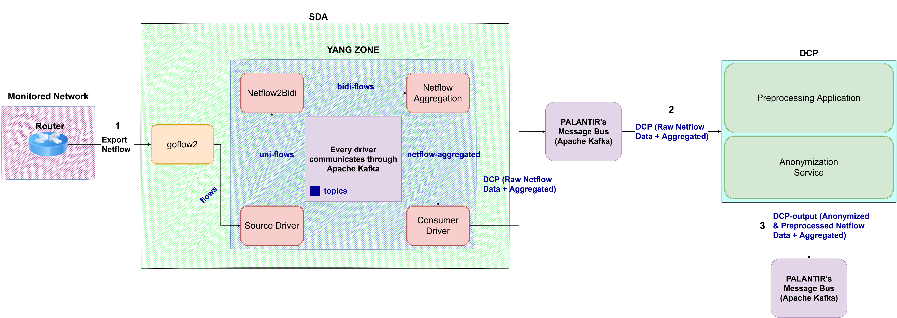

# SDA NetFlow full data pipeline within PALANTIR
This folder provides a Kubernetes Helm Chart used to deploy the SDA-related components (i.e., GoFlow2 collector and Flink applications) for the NetFlow full data pipeline processing on the PALANTIR platform.

To install the Helm Chart within the regarding K8s cluster, run the following command inside the current folder with the `helm` client:
```bash
helm [--kubeconfig <kubeconfig-file>] [-n <namespace>] install sda-netflow . --values ./values.yaml
```

To uninstall it run the following command with the `helm` client:
```bash
helm [--kubeconfig <kubeconfig-file>] [-n <namespace>] uninstall sda-netflow
```

The [values.yaml](values.yaml) file allows parameterizing differents arguments needed to deploy each application related to the SDA component. The main arguments are the following:
- `name`: The name of the Kubernetes application.
- `repository`: The container image needed to build and deploy the Kubernetes application. Each SDA application has a customize Docker image that has to be uploading/downloading to/from a Docker image registry available at a particular endpoint (i.e., `<k8s-registry-ip>:<k8s-registry-port>`) in the Kubernetes cluster.
- `kafka`, `input_topic`, and `output_topic`: The Kafka broker service endpoint and the input and output topics associated with each SDA application.

For the deployment of `SDA` components related to NetFlow processing, the integration with `Threat Intelligence` components within the PALANTIR infrastructure is required. Specifically, the integration of the `SDA` with the `Distributed Collection and Data Preprocessing` component (i.e., `DCP`) is required. For the integration between the `SDA` and the `DCP`, the proposed architecture is as follows:



- In step 1 the exported packets will be received by the `SDA` component using Goflow2 as a collector, this NetFlow information will be aggregated to give bidirectional information and the aggregated features.

- The output of the `SDA` (2) will be written in PALANTIR’s Kafka with the schema `Raw NetFlow Data` + `Aggregated features`:

```bash
ts,te,td,sa,da,sp,dp,pr,flg,fwd,stos,ipkt,ibyt,opkt,obyt,in,out,sas,das,smk,dmk,dtos,dir,nh,nhb,svln,dvln,ismc,odmc,idmc,osmc,mpls1,mpls2,mpls3,mpls4,mpls5,mpls6,mpls7,mpls8,mpls9,mpls10,cl,sl,al,ra,eng,exid,tr,zeek_extra_field,pktips,pktops,bytips,bytops,bytippkt,bytoppkt,bytipo,pktipo
```

>The `zeek_extra_field` is an extra field to be added because is needed to be consider and filled by the `Zeek` monitoring component in PALANTIR. The Consumer Driver adds the `$` default value to this `zeek_extra_field`.

- The `DCP` component will consume this  `Raw NetFlow Data` + `Aggregated features` schema as input and using the Preprocessing application and Anonymization service will produce the schema `Anonymized & Preprocessed NetFlow Data` + `Aggregated features` (3):

```bash
ts,te,td,sa,da,sp,dp,pr,flg,fwd,stos,ipkt,ibyt,opkt,obyt,in,out,sas,das,smk,dmk,dtos,dir,nh,nhb,svln,dvln,ismc,odmc,idmc,osmc,mpls1,mpls2,mpls3,mpls4,mpls5,mpls6,mpls7,mpls8,mpls9,mpls10,cl,sl,al,ra,eng,exid,tr,zeek_extra_field,pktips,pktops,bytips,bytops,bytippkt,bytoppkt,bytipo,pktipo,tpkt,tbyt,cp,prtcp,prudp,pricmp,prigmp,prother,flga,flgs,flgf,flgr,flgp,flgu
```
