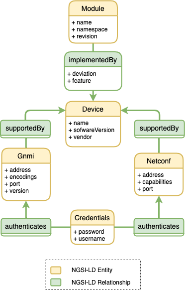
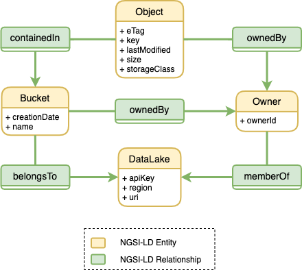

## NGSI-LD Information Models

The ETSI CIM standards specify a framework for exchanging context information. As part of the specification, ETSI CIM introduces the NGSI-LD information models to represent the the context information.

This repository stores information models that describe the metadata associated to the different data sources and data consumers which are integrated with the semantic data aggregator. Such models can be found within [`docs`](docs) folder. This folder also includes some diagrams explaining design ideas for the project.

### Metric Data Source

Information model that describes a metric-based data source. More specifically, a Prometheus-based data source. Notice the `MetricFamily` entity, which is a concept characteristic of Prometheus (and OpenMetrics).

### Telemetry Data Source

Information model that describes a telemetry-based data source. This data source is represented by a telemetry service supported by a network device. Our current prototype focuses on gNMI and NETCONF protocols.

### Kafka Data Source

Information model that describes a Kafka-based data source. For now, the information model is pretty simple as only describes the Kafka broker and the endpoint associated to it. Kafka topic information is defined as part of the `EVESource` entity, which represents the configuration of a Kafka consumer for the 5GEVE use case. An example that uses such entity can be found [here](docs/information-models/data-sources/kafka/kafka-model-EVESource.png)

###  Metrics and Telemetry Information Model Diagram

The following figure depicts an example of a simplified information model that includes a Metric-based data source (i.e., Prometheus) along with a Telemetry-based data source (i.e., gNMI telemetry). Additionally, the diagram describes the data pipeline that is responsible for collecting data from these two source, aggregate the data through a stream processing application, and eventually, the delivery of the data to a data consumer (represented by the `MetricTarget` entity).

### 5G-CLARITY Data Lake

This information model portrays the context information related to IDCC's Data Lake within the 5G-CLARITY project. The 5G-CLARITY Data Lake builds on AWS S3 object storage service, hence the modelling of `Bucket` and `Object` entities. Note that the Data Lake can be deemed either as a data source or as a data consumer. The model depicted below is agnostic to this configuration. More details on the Data Lake will be provided in 5G-CLARITY D4.3 deliverable.

